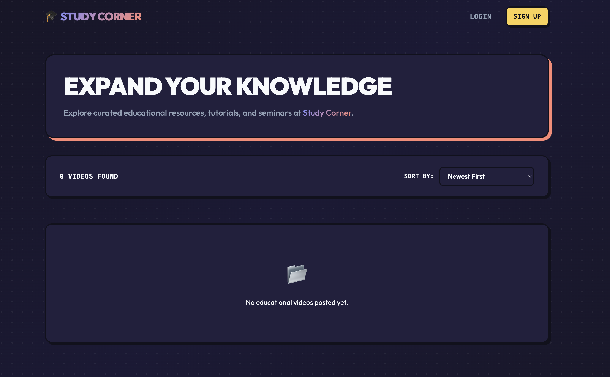
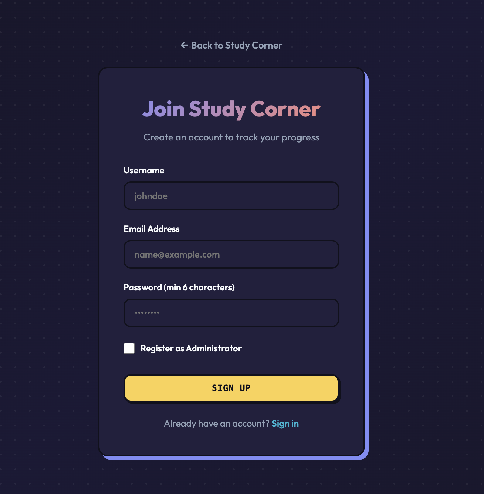
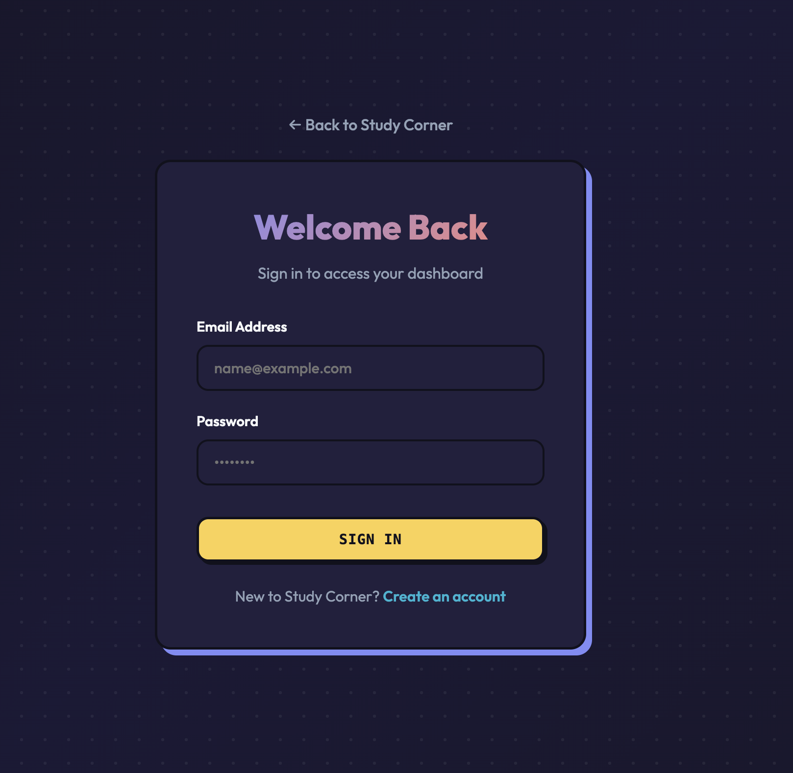
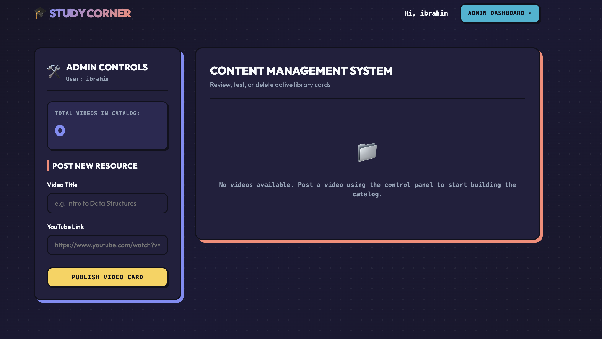
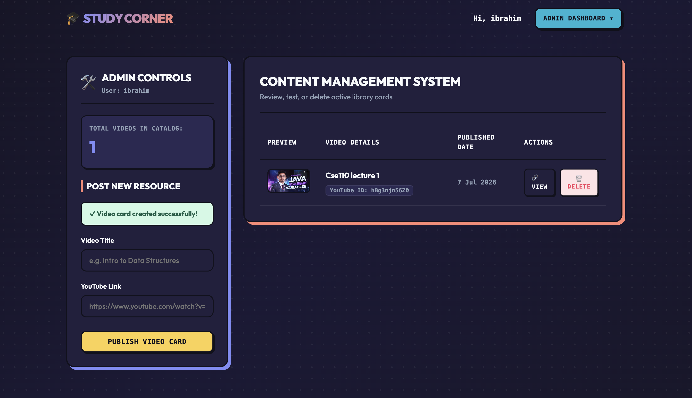
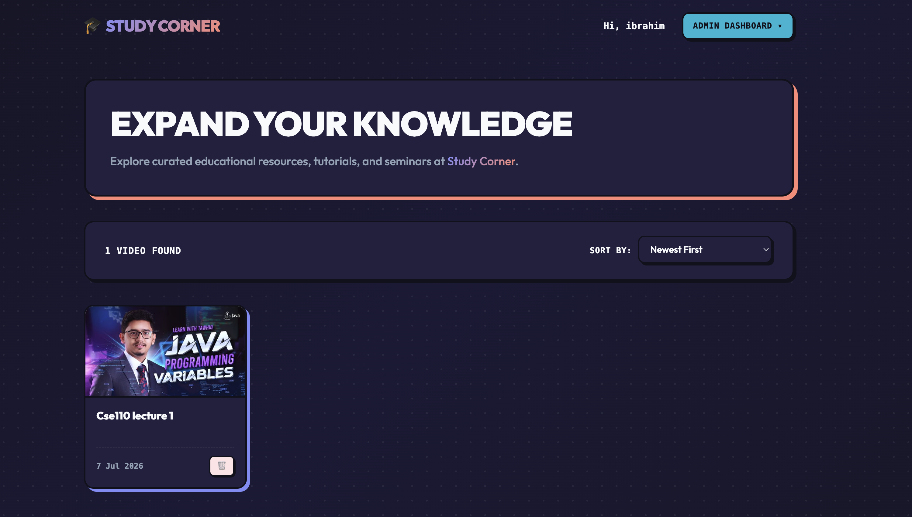
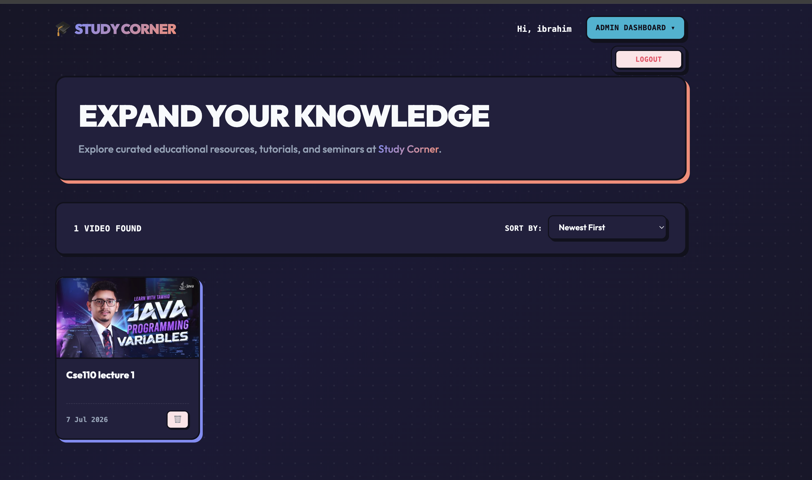
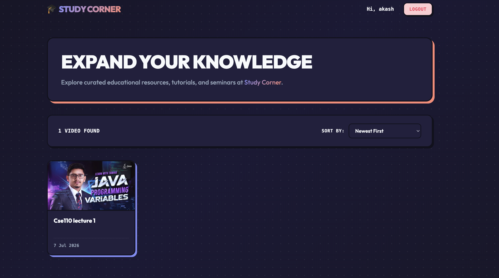

# BUCC Study Corner - MERN Educational Video Platform

BUCC Study Corner is an industry-standard full-stack web application designed for curated educational video sharing. The platform features a robust Express.js backend with JWT-secured endpoints and MongoDB integration, alongside a responsive React.js frontend styled with a custom, artistic Soft Neo-Brutalism design system.

---

## Table of Contents
1. [Project Directory Structure](#1-project-directory-structure)
2. [Backend Architecture & API Endpoints](#2-backend-architecture--api-endpoints)
3. [Frontend Architecture & State Management](#3-frontend-architecture--state-management)
4. [Environment Configuration](#4-environment-configuration)
5. [Getting Started & Installation](#5-getting-started--installation)

---

## 1. Project Directory Structure

The project is structured logically separating concern areas, with the backend located at the root level and the frontend localized inside the `/client` directory.

```
BUCC-Study-Corner/
├── client/                     # React.js Frontend (Vite)
│   ├── public/                 # Static public assets
│   ├── src/
│   │   ├── auth/               # Global Authentication State (Context)
│   │   ├── components/         # Reusable UI Components (Navbar, VideoCard)
│   │   ├── config/             # API connection settings
│   │   ├── domain/             # API wrappers (Auth and Video services)
│   │   ├── infrastructure/     # Request interceptors and custom hooks
│   │   ├── pages/              # Page view modules (Videos, Login, Register, Admin)
│   │   ├── App.jsx             # Main Router structure
│   │   ├── index.css           # Soft Neo-Brutalism light system styles
│   │   └── main.jsx            # Application mount point
│   ├── package.json            # Frontend dependency manifest
│   └── vite.config.js          # Vite configurations
│
├── config/                     # Backend Configuration Modules (MongoDB Mongoose connection)
├── middleware/                 # Express middleware (Auth validation and route guards)
├── models/                     # Mongoose Schema Definitions (User, Video)
├── routes/                     # Express Router Modules (Auth, Video routes)
├── utils/                      # Helper utilities (YouTube link parser)
├── .env                        # Local secret configurations (ignored by git)
├── .env_example                # Public environment configuration template
├── .gitignore                  # Git ignore rules for root level
├── app.js                      # Express App initialization and middleware stack
├── package.json                # Backend dependency manifest
└── server.js                   # Node entry point
```

---

## 2. Backend Architecture & API Endpoints

The backend is built using **Node.js**, **Express.js**, and **Mongoose (MongoDB)**. It features secure password storage using `bcryptjs` hashing, stateless JWT session generation, and strict administrative authorization checks.

### Authentication Middleware
*   `authenticateToken`: Extracts the Bearer token from the `Authorization` header, decodes it, and appends the user context to the request.
*   `requireAdmin`: Rejects requests with a `403 Forbidden` status code if the authenticated user's role is not `'admin'`.

### API Endpoints Catalog

#### 🔑 Authentication Routes (`/api/auth`)
| Method | Endpoint | Access | Description |
| :--- | :--- | :--- | :--- |
| `POST` | `/api/auth/register` | Public | Registers a new user. Expects `username`, `password`, and optional `role`. Admin role requires providing the `adminSecret` checked against system configurations. |
| `POST` | `/api/auth/login` | Public | Authenticates credentials and returns a JWT token under `token` and `user` metadata. |
| `GET` | `/api/auth/me` | Authenticated | Decodes JWT payload to return user session data on reload page triggers. |

#### 🎥 Video Management Routes (`/api/videos`)
| Method | Endpoint | Access | Description |
| :--- | :--- | :--- | :--- |
| `GET` | `/api/videos` | Public | Returns video catalogue. Supports sorting queries (`?sort=newest`, `?sort=oldest`, `?sort=title-asc`, `?sort=title-desc`). |
| `POST` | `/api/videos` | Admin Only | Creates a video. Automatically extracts 11-digit YouTube ID and generates high-res thumbnail link. Expects `title` and `youtubeUrl` in request body. |
| `DELETE` | `/api/videos/:id` | Admin Only | Deletes a video from the database by Object ID. |

---

## 3. Frontend Architecture & State Management

The frontend is bootstrapped with **React** and **Vite**, using standard web fetch requests optimized via a custom-designed interceptor system.

### Custom Authentication Framework
To avoid third-party Axios dependencies, the client implements a lightweight, native Fetch interceptor:
*   `AuthContext`: Houses active user state, JWT tokens, and login/logout handlers.
*   `useAuthFetch`: A custom hook that intercepts requests to automatically inject `Authorization: Bearer <token>` headers, configures JSON formats, handles `401 Unauthorized` token expiry states, and clears sessions dynamically.
*   `persistReload`: Retrieves cached localStorage tokens on boot and pings `/api/auth/me` to restore active admin sessions.

### Design Aesthetics & Responsiveness
*   **Artistic Soft Neo-Brutalism:** Features a soft, pastel eye-friendly gradient backdrop (`#e8edf4` to `#e6f7ed`) layered beneath a dark dot-grid pattern. Containers utilize solid cream-white surfaces (`#fafbfc`) with thick dark outlines (`2.5px solid #090816`) and alternating colored drop shadows (violet, peach, yellow).
*   **Direct YouTube Play:** Replaces modal popups with direct new-tab redirections on card click, optimizing UX metrics.
*   **Responsive CMS:** Admin panels and video grids feature auto-stacking grids and scrolling tables (`overflow-x: auto`) for mobile compatibility.

---

## 4. Environment Configuration

Create a `.env` file in the root directory following the [.env_example](file:///Users/ibrahim/Documents/BUCC-Study-Corner/.env_example) schema:

```env
PORT=5001
MONGO_URI=mongodb://localhost:27017/bucc
JWT_SECRET=your_super_secure_jwt_secret_key
ADMIN_SIGNUP_SECRET=your_admin_registration_password_secret
```

---

## 5. Getting Started & Installation

### Prerequisites
*   Node.js (v18.x or higher)
*   MongoDB running locally (or Docker installed)

### Setup Instructions

1.  **Clone and enter directory:**
    ```bash
    git clone https://github.com/MdFahimHassan/BUCC-Study-Corner.git
    cd BUCC-Study-Corner
    ```

2.  **Install dependencies:**
    ```bash
    # Install backend dependencies
    npm install

    # Install client dependencies
    cd client
    npm install
    cd ..
    ```

3.  **Configure environment:**
    Copy `.env_example` to `.env` and fill in your secrets.

4.  **Run MongoDB Container (optional):**
    ```bash
    docker run -d --name studycorner-mongo -p 27017:27017 mongodb/mongodb-community-server:latest
    ```

5.  **Start application servers:**
    ```bash
    # Run backend development server (from root directory)
    npm run dev

    # Run frontend client (from another terminal inside /client)
    cd client
    npm run dev
    ```

Open your browser to `http://localhost:5173` to test the application!

---

## 6. Live Demonstration Tour

Below is a step-by-step visual demonstration of the system workflows:

### 1. Unauthenticated Visitor Landing Page (Startup)
When a user first lands on the platform, they see a clean, distraction-free landing page with authentication controls in the top-right and a videos list (currently empty).



### 2. Administrator & Student Registration
Visitors can create a student account or toggle the administrator checkbox to register with the secure signup key from system configurations.



### 3. User Authentication
A clean, secure card-based interface handles JWT session generation for students and administrators.



### 4. Admin CMS Dashboard (Empty state)
Once logged in, administrators can access a split-screen dashboard workspace to manage resources.



### 5. Resource Publication
Adding a valid YouTube link automatically extracts details to generate video cards and high-resolution thumbnail graphics.



### 6. Admin Home Catalogue View
Administrators are redirected to the homepage on login, where the vibrant *Admin Dashboard* button appears in the top-right header.



### 7. Hover-Based Session Control
Hovering over the *Admin Dashboard* button triggers a smooth dropdown listing the session termination options.



### 8. Student Home Catalogue View
Authenticated students land on the home catalog showing the custom-bordered video grid, sorting selectors, and a direct logout action button.



